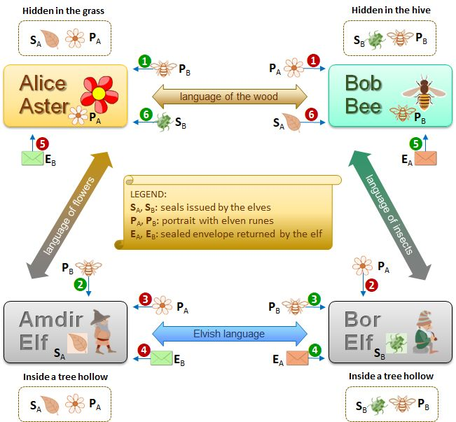
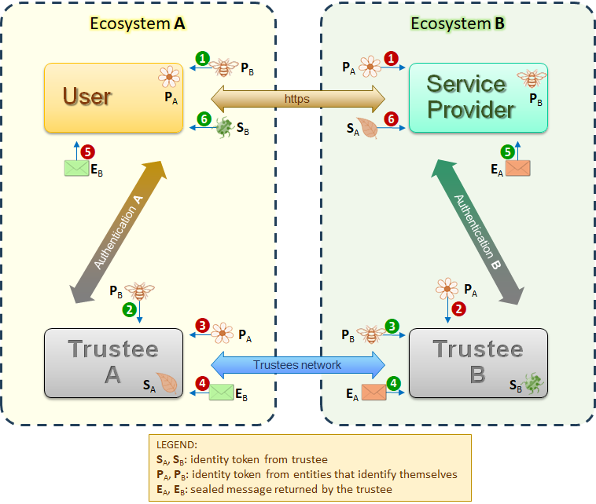

# Identity Trust System
Everything related to the documentation of the **identity trust system** is here included.

It is an **identity authentication system** that does not require federation of authentication domains. The main components are a **symmetric authentication protocol** and a specific infrastructure to ensure trust in the identity providers. The narrative was exposed in some my articles published on ISACA Journal (see [LS1], [LS2], [LS3], [LS4]). Regarding the components:
1. **Symmetric authentication protocol** - Both entities must make themselves known and are authenticated by their identity provider according to a symmetric scheme. This protocol builds on and extends the OAuth Authorization Framework [RFC6749].
2. **Trustees’ network** - A special network dedicated to creating a protected channel for exchanging authentication messages between IdPs constitutes the infrastructure to avoid domain federation.
3. **Custodian concept** - To better protect personal data IdPs are divided into two types. A generic IdP (trustee) for pure digital authentication and a specific IdP (custodian) under the control of the authority with legal right to the individual's real data, to guarantee physical identity.

The idea can be explained with an example from the fantasy world. In the forest of the Wise Elves, suppose that Bob the bee wants to buy pollen from Alice the flower. Also, Alice and Bob do not know each other and speak two different languages. However, Alice trusts the elf Amdir and they speak to each other in the language of flowers, while Bob trusts the elf Bor and they speak to each other in the language of bees. The wise elves speak to each other in the elven language known only to them.

Bob begins the communication by giving Alice his identity card guaranteed by the elf Bor. Alice gives Bob her identity card guaranteed by the elf Admir. Then, Alice asks Admir in the language of flowers to verify Bob's identity, while Bob asks Bor in the language of bees to verify Alice's identity. Admir and Bor, communicating in the ancient elven language, exchange the identity cards received and verify them. Finally, Admir communicates the answer to Alice, while Bor communicates the answer to Bob. If the verification is positive, Alice will give the pollen to Bob.

Figure 1 shows a use case describing the message flow between Alice and Bob.

  
***Figure 1***: Identification schema in the forest of the Wise Elves

Message exchange between digital ecosystems can occur in the same way. Simply replace Alice with the User and Bob with the Service Provider. The elves are replaced by their respective trustees (Identity Provider), i.e. the trusted entity that guarantees the authentication of the digital identity. The IdPs communicate with each other on a network dedicated to them.

Figure 2 shows a use case describing the message flow between in digital ecosystems.

  
***Figure 2***: Identification scheme in digital ecosystems

The two representations are very similar to each other. but it is noted that the symmetric protocol introduces direct communication between the identity providers' authentication servers to allow the circular transit of authentication messages. This direct communication between IdPs allows you to avoid trust between domains.

<!-- References -->

[LS1]: https://www.isaca.org/resources/isaca-journal/issues/2022/volume-2/a-symmetrical-framework-for-the-exchange-of-identity-credentials-based-on-the-trust-paradigm-part-1
'L. Sbriz,
"A Symmetrical Framework for the Exchange of Identity Credentials Based on the Trust Paradigm, Part 1: Identity Trust Abstract Model",
ISACA Journal, 2022-04, vol.2'
  
[LS2]: https://www.isaca.org/resources/isaca-journal/issues/2022/volume-2/a-symmetrical-framework-for-the-exchange-of-identity-credentials-based-on-the-trust-paradigm-part-2
'L. Sbriz,
"A Symmetrical Framework for the Exchange of Identity Credentials Based on the Trust Paradigm, Part 2: Identity Trust Service Implementation",
ISACA Journal, 2022-04, vol.2'
    
[LS3]: https://www.isaca.org/resources/isaca-journal/issues/2023/volume-1/how-to-digitally-verify-human-identity
'L. Sbriz,
"How to Digitally Verify Human Identity: The Case of Voting",
ISACA Journal, 2023-01, vol.1'
    
[LS4]: https://www.isaca.org/resources/isaca-journal/issues/2023/volume-6
'L. Sbriz,
"Modeling an Identity Trust System",
ISACA Journal, 2023-11, vol.6'

[RFC6749]: https://www.rfc-editor.org/rfc/rfc6749
'Hardt, D., Ed., "The OAuth 2.0 Authorization Framework", RFC 6749, DOI 10.17487/RFC6749, October 2012'
