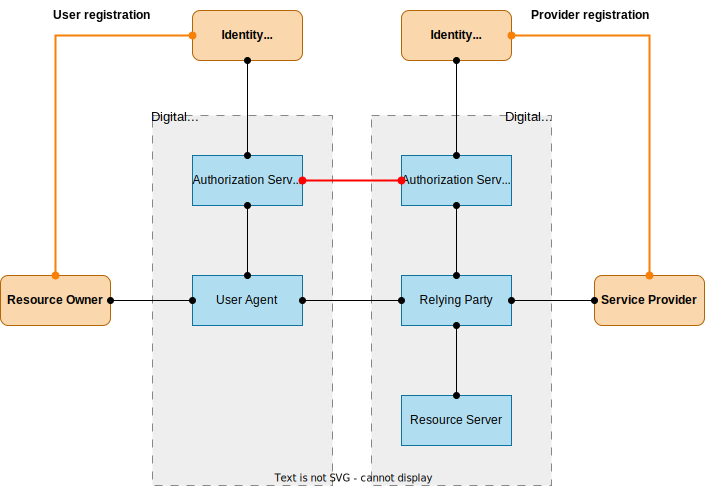

# Identity Trust System
Everything related to the **identity trust system** is here included.

It is an **identity authentication system** that does not require federation of authentication domains. The main components are a symmetric authentication protocol and a specific infrastructure to ensure trust in the identity providers. The narrative was exposed in some my articles published on ISACA Journal (see [LS1], [LS2], [LS3], [LS4]). Regarding the components:
1. Symmetric authentication protocol - Both entities must make themselves known and are authenticated by their identity provider according to a symmetric scheme. This protocol builds on and extends the OAuth Authorization Framework [RFC6749].
2. Trustees’ network - A special network dedicated to creating a protected channel for exchanging authentication messages between IdPs constitutes the infrastructure to avoid domain federation.
3. Custodian concept - To better protect personal data IdPs are divided into two types. A generic IdP (trustee) for pure digital authentication and a specific IdP (custodian) under the control of the authority with legal right to the individual's real data, to guarantee physical identity.

Figure 1 shows the components of the classic authentication method [RFC6749].

  
Figure 1: Authorization Flow – Asymmetrical

Figure 2 shows the components needed to enable authentication outside your digital ecosystem.

  
Figure 2: Authorization Flow – Symmetrical

[//]: # (This may be the most platform independent comment)

# References

[LS1]: ""
    L. Sbriz,
      "A Symmetrical Framework for the Exchange of Identity Credentials
      Based on the Trust Paradigm, Part 1: Identity Trust Abstract
      Model",
      ISACA Journal, 2022-04, vol.2
  
[LS2]: ""
    L. Sbriz,
      "A Symmetrical Framework for the Exchange of Identity Credentials
      Based on the Trust Paradigm, Part 2: Identity Trust Service
      Implementation",
      ISACA Journal, 2022-04, vol.2
    
[LS3]: ""
    L. Sbriz,
      "How to Digitally Verify Human Identity: The Case of Voting",
      ISACA Journal, 2023-01, vol.1
    
[LS4]: ""
    L. Sbriz,
      "Modeling an Identity Trust System", ISACA Journal, 2023-11, vol.6 (to be issued)
